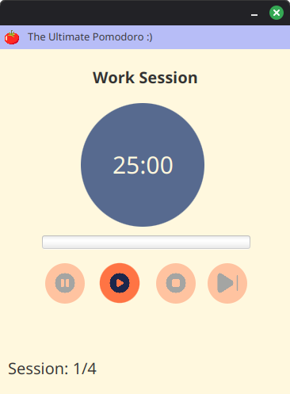

# BillBuddy - Tip Calculator

The Ultimate Pomodoro App :)

---

## Preview



---

## Prerequisites

Before running the application, make sure you have:

- JDK 17 or higher (tested on recent versions)
- IDE (recommended: IntelliJ IDEA, Eclipse, or VS Code)
- JavaFX SDK (Download here: https://gluonhq.com/products/javafx/ — extract to a folder like C:\javafx-sdk or /home/user/javafx-sdk)
- Scene Builder (optional — for editing the .fxml UI)

---

## Setup & Installation

### 1. Clone the Repository

```bash
git clone https://github.com/bray-hiramis/ultimate-pomodoro.git
cd ultimate-pomodoro
```
### 2. Open in Your IDE

IntelliJ IDEA (easiest):
- Open → select the project folder
- It should detect the JavaFX nature automatically if modules are set up

Eclipse or VS Code:
- Import as existing project
- Make sure JavaFX is on the module path (see below)


### 3. Configure JavaFX (important!)

Add these VM arguments to your run configuration:

> text--module-path "/path/to/javafx-sdk/lib" --add-modules javafx.controls,javafx.fxml

Example (Linux/macOS):
> text--module-path "/home/user/javafx-sdk/lib" --add-modules javafx.controls,javafx.fxml

Example (Windows):
> text--module-path "C:\javafx-sdk\lib" --add-modules javafx.controls,javafx.fxml

If you see native access warnings (Java 17+), also add:
> text--enable-native-access=javafx.graphics

Tip: In IntelliJ → Edit Configurations → Application → VM options field → paste the line above.

### 4. Run the Application

- Main class: application.Main
- Right-click → Run 'Main.main()'
- The window should launch with the app ready!


## Features

- Start, pause, skip, and reset.


## Author
Bray Hiramis → https://github.com/bray-hiramis

## About
The Ultimate Pomodoro app is built in Java and JavaFX, and design in Scene Builder.

Feel free to fork, improve, or use it as a reference for your own JavaFX apps!